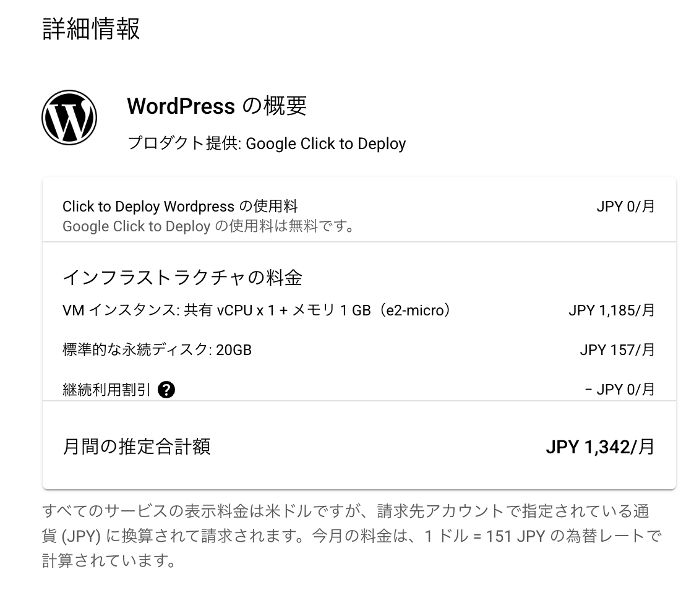

# WordPress Deploy 手順書

はじめに
- すでにメインサイトを運営（ドメインを所有）していて、そのドメインのサブディレクトリとしてオウンドメディアを構築したい場合のセットアップ手順を示した。

ゴール
- メインサイトのサブディレクトリとしてWordPressサーバーにhttps通信でアクセスできること

- 例: https://logicalift.com のサブディレクトリhttps://logicalift.com/blog にアクセスするとWordPressサーバー（Google CloudのVMインスタンス）とのhttps通信が成立する

## 1. WordPress Google Click to Deploy

**参考リンク:**
- [Google Cloud WordPress](https://cloud.google.com/wordpress?hl=ja)
- [TopGate Blog - Google Service](https://www.topgate.co.jp/blog/google-service/10853)

一番安いプランでこれ



## 2. ネットワーク設定 (ファイアウォール)
ファイアウォールルール作成: GCPコンソールの [VPCネットワーク] > [ファイアウォール] で、以下のルールを作成します。

**1. ロードバランサーからのヘルスチェック許可:**
- 名前: allow-lb-health-checks (任意)
- ターゲットタグ: allow-lb-health-checks (任意、後でVMに付与)
- ソースIP範囲: 130.211.0.0/22, 35.191.0.0/16
- プロトコルとポート: tcp:80

**2. ロードバランサーからのHTTPトラフィック許可:**
- 名前: allow-lb-http-traffic (任意)
- ターゲットタグ: allow-lb-http-traffic (任意、後でVMに付与)
- ソースIP範囲: 130.211.0.0/22, 35.191.0.0/16
- プロトコルとポート: tcp:80

## 3. SSL/TLS証明書の準備 (Certificate Manager)
**1. 証明書リクエスト: GCPコンソールの [ネットワーク セキュリティ] > [Certificate Manager] で「証明書を作成」を選択。**

**2. Googleマネージド証明書: 「Google マネージド証明書」を選択し、名前を付けます (例: logicalift-com-cert)。**

**3. ドメイン: （例）logicalift.com を入力します。（サブドメインではなく、メインドメイン）**

**4. 認証方法: 「DNS 認証」を選択します。**

**5. CNAMEレコードの確認: 作成後、証明書の詳細画面に表示されるCNAMEレコードの情報をコピーしておきます。（DNS設定は後ほど行います）**

**6. 有効化待機: Certificate Managerで証明書のステータスが Active になるまで待ちます（DNS設定後、数分～数時間）。**

## 4. WordPressでの設定
**1. ネットワークタグ付与:**
- [Compute Engine] > [VMインスタンス] で対象のVMインスタンスを選択し、「編集」をクリックします。
- 「ネットワークタグ」の項目に、手順2で作成したファイアウォールルールで使用したターゲットタグ (allow-lb-health-checks, allow-lb-http-traffic) を追加し、保存します。

**2. wp-config.php 編集:**

- SSHでVMインスタンスに接続します。
- WordPressのルートディレクトリにある wp-config.php を編集します (例: sudo nano /var/www/html/wp-config.php)。
- "<?php" の直後あたりに以下のコードを追加または修正します。WP_HOMEとWP_SITEURLをサブディレクトリ形式のURLに変更します。

```php
// Define WordPress address (URL) and Site address (URL) for subdirectory
define('WP_HOME', 'https://logicalift.com/blog');
define('WP_SITEURL', 'https://logicalift.com/blog');

// Trust X-Forwarded-Proto header from Load Balancer/Proxy
if (isset($_SERVER['HTTP_X_FORWARDED_PROTO']) && $_SERVER['HTTP_X_FORWARDED_PROTO'] === 'https') {
    $_SERVER['HTTPS'] = 'on';
}

// Add fix for potential redirect loops behind proxy
if (isset($_SERVER["HTTP_X_FORWARDED_FOR"])) {
    $_SERVER['REMOTE_ADDR'] = $_SERVER["HTTP_X_FORWARDED_FOR"];
}
```

- ファイルを保存してエディタを終了します。

**3. パーマリンク設定変更:**
- (後でロードバランサー経由でアクセスできるようになった後に行います) WordPress管理画面にログインし、[設定] > [パーマリンク設定] で「カスタム構造」を選択し、/blog/%postname%/ のように /blog プレフィックスを含む形に設定して「変更を保存」します。

## 5. インスタンスグループ作成
**1. インスタンスグループ作成:**
- [Compute Engine] > [インスタンス グループ] で「インスタンス グループを作成」を選択。

**2. 非マネージドインスタンスグループ:**
- 「非マネージド インスタンス グループ」を選択。

**3. 設定:**
- 名前: wordpress-blog-ig (任意)
- ネットワーク: VMと同じVPCネットワークを選択。
- ゾーン: VMと同じゾーンを選択。
- ポート マッピング: 「ポートを追加」をクリックし、ポート名: http, ポート番号: 80 を設定。
- VM インスタンス: 「VM インスタンスを選択」で、既存のWordPress VMインスタンスを追加。
- 「作成」をクリックします。

## 6. 静的外部IPアドレス予約
- IPアドレス予約: [VPCネットワーク] > [IPアドレス] で「静的外部IPアドレスを予約」を選択。
- 設定:
- 名前: lb-logicalift-blog-ip (任意)
- ネットワーク サービスティア: プレミアム (推奨)
- IP バージョン: IPv4
- タイプ: グローバル を選択。
- 「予約」をクリックし、予約されたIPアドレスをメモしておきます。

## 7. プロキシ専用サブネット作成
グローバル外部アプリケーションロードバランサーには、バックエンドが存在するリージョンごとにプロキシ専用サブネットが必要です。

- サブネット作成画面へ: [VPCネットワーク] > [サブネット] で「サブネットを作成」をクリックします。
- 設定:
- 名前: proxy-only-subnet-asia-northeast1
- ネットワーク: default (VMインスタンスと同じVPC)
- リージョン: asia-northeast1 (VMインスタンスと同じリージョン)
- 目的: プルダウンから プロキシ専用 (PROXY_ONLY) を選択します。
- IPスタックタイプ: IPv4
- IPv4範囲: 10.129.0.0/26 (既存サブネットと重複しない範囲を指定)
... 推奨される範囲は/26（64IP）以上。
- プライベート Google アクセス: オフ
- フローログ: オフ (必要であれば後でオンにする)
- 「作成」をクリックします。

## 8. 外部アプリケーション ロードバランサ作成
**1. ロードバランサ作成開始:**
- [ネットワーク サービス] > [ロード バランシング] で「ロードバランサを作成」を選択。
- 種類選択: 「アプリケーション ロードバランサ (HTTP/S)」の「構成を開始」をクリック。
- 設定:
- インターネット接続または内部専用: 「インターネットから VM へ」
- グローバルまたはリージョン: 「グローバル外部アプリケーション ロードバランサ」
- ロードバランサ名: logicalift-blog-lb (任意)
- プロキシ専用サブネット: 手順7参照のこと

**2. フロントエンドの構成:**
- 名前: https-frontend-main (任意)
- プロトコル: HTTPS
- IP アドレス: 手順6で予約した静的外部IPアドレスを選択。
- ポート: 443
- 証明書: 手順3で作成した logicalift.com 用の証明書を選択。（ステータスがActiveになっている必要があります）

**3. バックエンドの構成:**
- 「バックエンド サービスを作成」を選択。
- 名前: wordpress-blog-backend-service (任意)
- バックエンド タイプ: インスタンス グループ
- プロトコル: HTTP
- 名前付きポート: http
- バックエンド: インスタンス グループ: 手順5で作成した wordpress-blog-ig を選択。
- ヘルスチェック: 「ヘルスチェックを作成」を選択
- Cloud CDN: チェックを外したまま。
- 「作成」をクリック。

**4. ルーティング ルール:**
- デフォルトのルール (* のホスト、/* のパス) は削除するか、別のバックエンド（例: 固定エラーページ用バケットなど）に向けるように変更します。
- 「ホストとパスのルールを追加」 をクリックします。
- ホスト: freelance-job.com （または * でも可）
- パス:
- /blog
- /blog/*
- バックエンド: 作成した wordpress-blog-backend-service を選択します。
- 注意: この設定により、/blog で始まるパスへのリクエストのみがWordPressバックエンドに転送されます。
- 確認と完了: 設定内容を確認し、「作成」をクリック。デプロイ完了まで数分待ちます。

## 10. フロントプロキシ (Vercel等) の設定
- 転送設定: Vercelの vercel.json などで、/blog および /blog/* へのリクエストを、HTTPS でGCPロードバランサーの外部IPアドレス（手順6で予約したもの）に転送するように設定します。

// vercel.json の例
```javascript
{
  "rewrites": [
    {
      "source": "/blog",
      "destination": "https://[手順6で予約したGCPロードバランサーの外部IPアドレス]/blog" // パスも維持
    },
    {
      "source": "/blog/:path*",
      "destination": "https://[手順6で予約したGCPロードバランサーの外部IPアドレス]/blog/:path*" // パスも維持
    }
    // 他のリライトルール
  ]
  // 他のVercel設定
}
```

設定をデプロイします。

## 11. 既存VMの外部IP削除
- 動作確認: DNS設定とVercelのデプロイが完了し、設定が反映された後（数分～数時間）、ブラウザで https://freelance-job.com/blog にアクセスし、WordPressサイトが正しく表示され、HTTPSになっていることを確認します。パーマリンク設定もこのタイミングで行います（手順4.3）。

- 外部IP削除: 動作確認ができたら、[Compute Engine] > [VMインスタンス] で対象のVMインスタンスを選択し、「編集」をクリックします。「ネットワーク インターフェース」セクションで、「外部 IP」を『なし (None)』に変更し、保存します。

## 12. 最終確認
- 再度 https://freelance-job.com/blog にアクセスし、問題なく表示されることを確認します。
- WordPress管理画面 (https://freelance-job.com/blog/wp-admin/) へのアクセスも確認します。
- (推奨) 不要になった可能性のあるファイアウォールルールを見直して削除します。

以上で移行作業は完了です。
