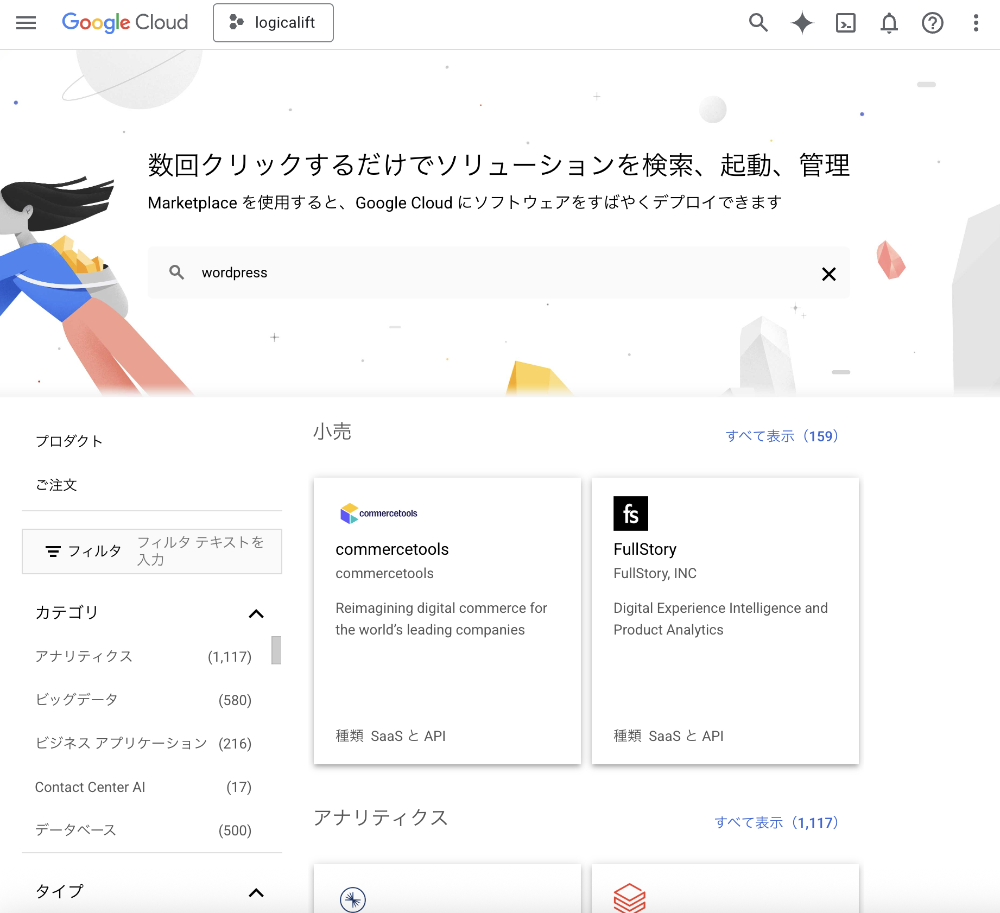
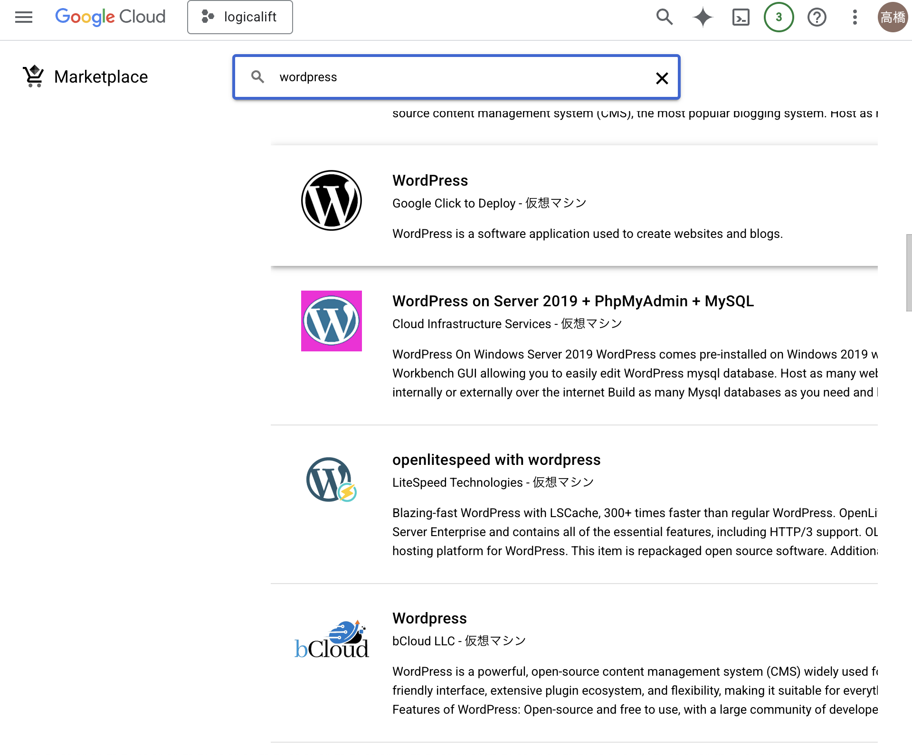
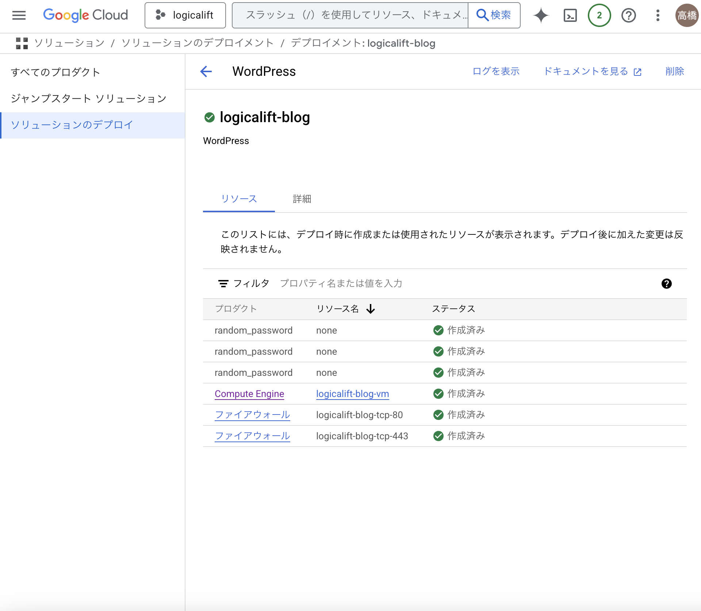
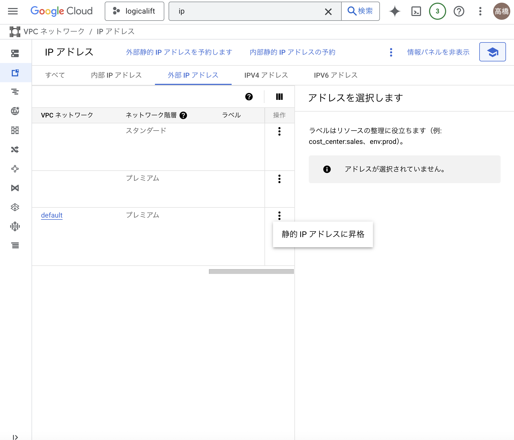
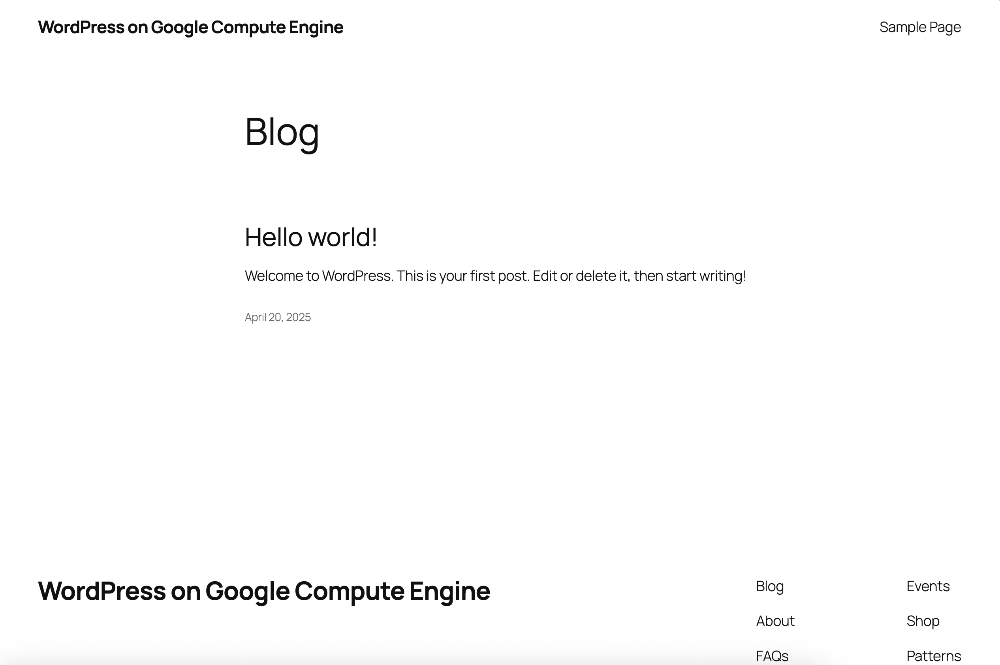

# WordPress Deploy 開発手順書

ちょっと早速脱線
- 何かドキュメントを残したり手順書を残したいときは、individual配下にディレクトリを作ってgit管理してしまおう！
Notionに書く場合との見極め
Cursorエージェントと一緒に書くべきだと考えられるとき。コーティング要素が多かったり、壁打ちを前提としてドキュメントを残していきたいときなど。

## WordPress Google Click to Deploy
参考: 
- https://cloud.google.com/wordpress?hl=ja
- https://www.topgate.co.jp/blog/google-service/10853

### 1. Google Cloud プロジェクトで Google Cloud Marketplace と Compute Engine を有効にします。

### 2. Cloud Marketplace で WordPress 仮想マシン（VM）を検索し、アプリケーションを起動します。

   
   

### 3. WordPress インスタンスを Compute Engine にデプロイします。
   一番安いプランでこれ
   
   

### 4. VM インスタンスに静的 IP アドレスを予約します。

   
   
   -> この時点で外部IPを叩けばWordPressの画面にアクセス可能
   http://外部静的IPアドレス

   

   しかし、HTTPS通信を有効にする必要がある。

### HTTPS通信の実現方法

セキュリティとSEO対策のため、WordPressサイトをHTTPS化する必要があります。以下に主な実現方法を紹介します。

#### 選択肢1: WordPress VMに直接SSL証明書を設定

**メリット**: 独立したHTTPSサイトとして運用できる  
**難易度**: ★★☆

1. 独自ドメイン（例: blog.logicalift.com）のDNS設定でAレコードを作成し、静的IPを指定
2. WordPressサーバーにSSH接続
3. Let's Encryptで無料のSSL証明書を取得
   ```bash
   sudo apt-get update
   sudo apt-get install certbot python3-certbot-apache -y
   sudo certbot --apache -d blog.logicalift.com
   ```
4. WordPressの設定で、サイトURLをhttps://に変更

#### 選択肢2: Google Cloud Load Balancerを使用

**メリット**: Googleのインフラを活用した堅牢な構成  
**難易度**: ★★★

1. GCPでHTTPSロードバランサーを作成
2. マネージドSSL証明書を設定
3. バックエンドサービスとしてWordPress VMを指定
4. DNSレコードをロードバランサーのIPに向ける

#### 選択肢3: Vercelによるリバースプロキシ（推奨）

**メリット**: 設定が最もシンプル、既存サイトとの統合が容易  
**難易度**: ★☆☆

1. Vercelでデプロイした既存サイト（logicalift.com）の`vercel.json`に以下を追加：
   ```json
   {
     "rewrites": [
       {
         "source": "/blog/:path*",
         "destination": "http://[WordPress静的IP]/:path*"
       }
     ]
   }
   ```

2. WordPress設定の調整（オプション）
   ```php
   // wp-config.phpに追加
   define('WP_HOME', 'https://logicalift.com/blog');
   define('WP_SITEURL', 'https://logicalift.com/blog');
   ```

3. パーマリンク設定を変更して `/blog/` プレフィックスに対応

この方法では、ユーザーとの通信はVercelを通じて常にHTTPSで行われます。WordPressサーバー自体はHTTPのままですが、外部からは安全なHTTPSとして提供されます。

#### 選択肢4: Nginx/Apacheリバースプロキシ

**メリット**: 完全なカスタマイズが可能  
**難易度**: ★★★

1. メインサーバー（Nginx/Apache）で既存のHTTPSサイトにリバースプロキシを設定
2. 設定例（Nginx）:
   ```nginx
   location /blog {
     proxy_pass http://[WordPress静的IP];
     proxy_set_header Host $host;
     proxy_set_header X-Forwarded-Proto https;
   }
   ```
